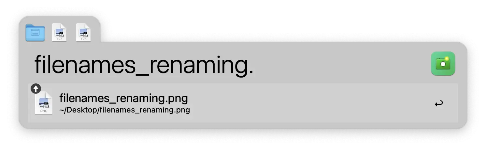
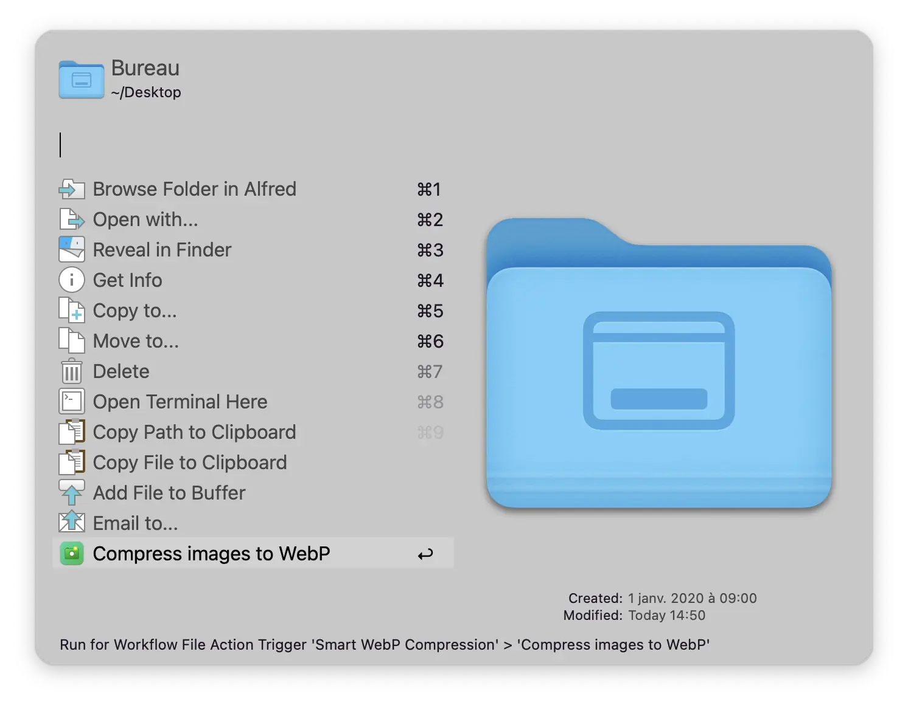
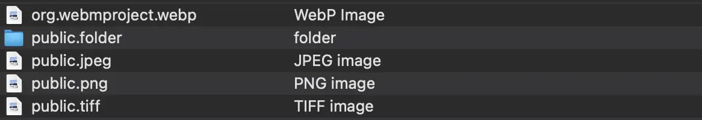
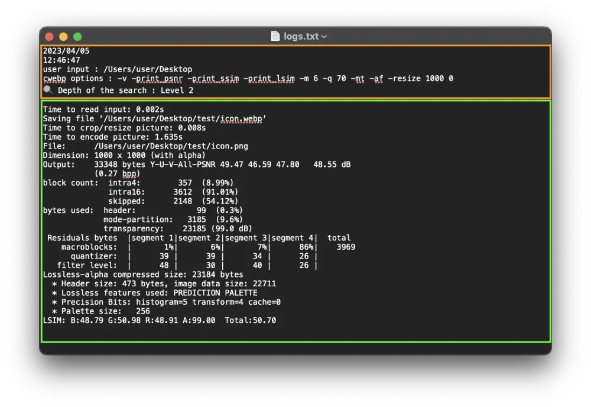

[](https://github.com/BenjaminOddou)
[](https://saythanks.io/to/BenjaminOddou)

Welcome to the Alfred Smart WebP repository: **An Alfred Workflow** ✨

## ✅ Prerequisites

* MacOS
* Alfred 5. Note that the [Alfred Powerpack](https://www.alfredapp.com/powerpack/) is required to use workflows.

## 🏎️ cwebp

Under the hood, the compression is made with [cwebp](https://developers.google.com/speed/webp/docs/cwebp) (made by Google), a tool that allows to compress images into the WebP format, which is generally lighter, and broadly used to share images on the web.

## ⬇️ Installation

1. [Download the workflow](https://github.com/BenjaminOddou/alfred-smart-webp-compression/releases/latest)
2. Double click the `.alfredworkflow` file to install

## 🧰 Setup the workflow

#### Open the Terminal of you Mac and run the following command:

Install cwebp (using [Homebrew](https://brew.sh)):

```shell
brew install webp
```

## 🧙‍♂️ Invoke the workflow

You can invoke the workflow by writing `webp` into the Alfred search box. You can change this value by changing the `🕹️ Trigger` variable in workflow configuration panel.

## 🤖 Usage of the workflow

### Handling presets

#### Create a preset

Go under the `presets section` and click on `Add a new preset`.

Add your preset by putting a `value`, press ⏎ and input a `title` and a `subtitle` separated by a `/`.

#### Modify a preset

Go under the `presets section` and click on the preset you want to modify.

Select wether you want to modify the `title/subtitle` or the `value` and press ⏎. Input the new title/subtitle or value and press ⏎.

#### Remove a preset

Under the `presets section`, click on `Remove a preset`.

Select the preset you want to remove and press ⏎.

### Start the compression

#### Using Workflow File Filter

Under the home menu, click on `Start the compression`.

Select the folder with images or directly the image you want to compress and press enter ⏎.

> Note that when selecting a folder, images within subdirectories aren't selected if `🔍 Depth of the search` is 1. If you want images in subdirectories, increase this value. Only images with `png|jpg|jpeg|tif|tiff|webp` file extensions are selected. In addition, they aren't case sensitive, meaning that the image extension can be `PNG|JpG|tifF...`

Here is an example where the user selected a folder and put `Level 2` in `🔍 Depth of the search` :
```shell
.
├── selected folder # Level 1
│   ├── subdirectory # Level 2
│   │   ├── image.PnG # selected ✅
│   │   ├── a nested folder # Level 3
│   │   │   ├── one image.webp # not selected ❌
│   │   │   └── a second image.tiff # not selected ❌
│   │   └── file.doc # not selected ❌
│   └── first-image.jpeg # selected ✅
```

Alternatively, use the `Alfred Buffer` to select folder(s) and image(s) at the same time !! Basic commands are :

* ⌥↑ to add a file to the buffer from Alfred's results.
* ⌥↓ to add a file and move to the next item in your list of results.
* ⌥← to remove the last item from the buffer.
* ⌥→ to action all items in the buffer.
* ⌥⌫ to remove all items from the buffer.

To know more on how to use `Alfred Buffer`, follow this [link](https://www.alfredapp.com/help/features/file-search/#file-buffer).

> Note that `Alfred Buffer` is preferred compare to the `{query}`, meaning that if you select a folder/image (by clicking on it or by pressing enter ⏎) that is not included in the buffer, **it will not be compressed**.



Choose the cwebp options by selecting a preset or input it manually by pressing `Manual options`.

#### Using Alfred Universal Actions

Select the folder(s) / image(s) you want to compress within alfred using `Quick Search` and run `Universal Actions` with → or ⌥→ if you used the `Alfred buffer`. Select "Compress images to WebP".



> Note that the workflow is type sensitive, meaning that if you select a file that is not part of the following types, the action "Compress images to WebP" will not be available



If you want to know more on how to use Alfred Universal Actions, follow this [link](https://www.alfredapp.com/help/features/universal-actions/).

#### Logs output

Check the logs of your compression under the `Data folder`. The log file contains the 2 parts. 

1. In the orange box there is :
	* Date of the compression with a `YYYY/MM/dd` pattern.
	* Exact time of the compression with a `HH:mm:ss` pattern.
	* Folder(s) + image(s) path(s) selected with a tab ⇥ separator.
	* Preset or manual input. Preset will be displayed as `preset_name,preset_detail` whereas manual input will be displayed raw.
	* The selected level of variable `🔍 Depth of the search`
2. In the green box there is the cwebp output.

> Note that each compression is separated by a line.



## ⚖️ License

[MIT License](LICENSE) © Benjamin Oddou
