[](https://github.com/BenjaminOddou)
[](https://saythanks.io/to/BenjaminOddou)

Welcome to the Alfred Smart WebP Compression repository: **An Alfred Workflowk** ✨

## ✅ Prerequisite

* 🍎 MacOS
* 🎩 Alfred 5. Note that the [Alfred Powerpack](https://www.alfredapp.com/powerpack/) is required to use workflows.

## ℹ️ information

* 🏎️ Under the hood, the compression is made with [cwebp](https://developers.google.com/speed/webp/docs/cwebp) (made by Google), a tool that allows to compress images into the WebP format, which is generally lighter 🪶, and broadly used to share images on the web.

## ⬇️ Installation

1. [Download the workflow](https://github.com/BenjaminOddou/alfred-smart-webp-compression/releases/latest)
2. Double click the `.alfredworkflow` file to install

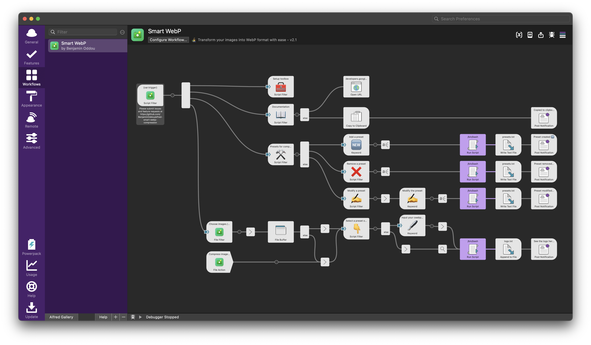

## 🧙‍♂️ Invoke the Workflow

You can invoke the workflow by writing `webp` onto the Alfred search box. You can change this value within the workflow [optionnal]. If you'd like to change the value, follow the steps below:

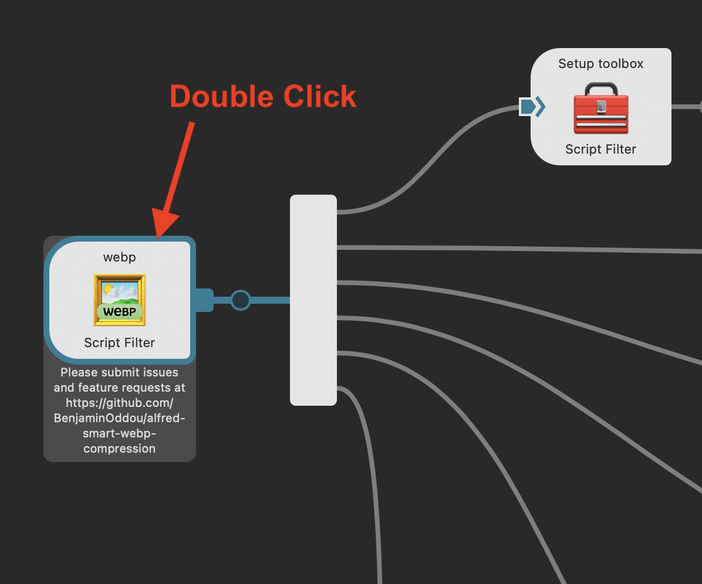

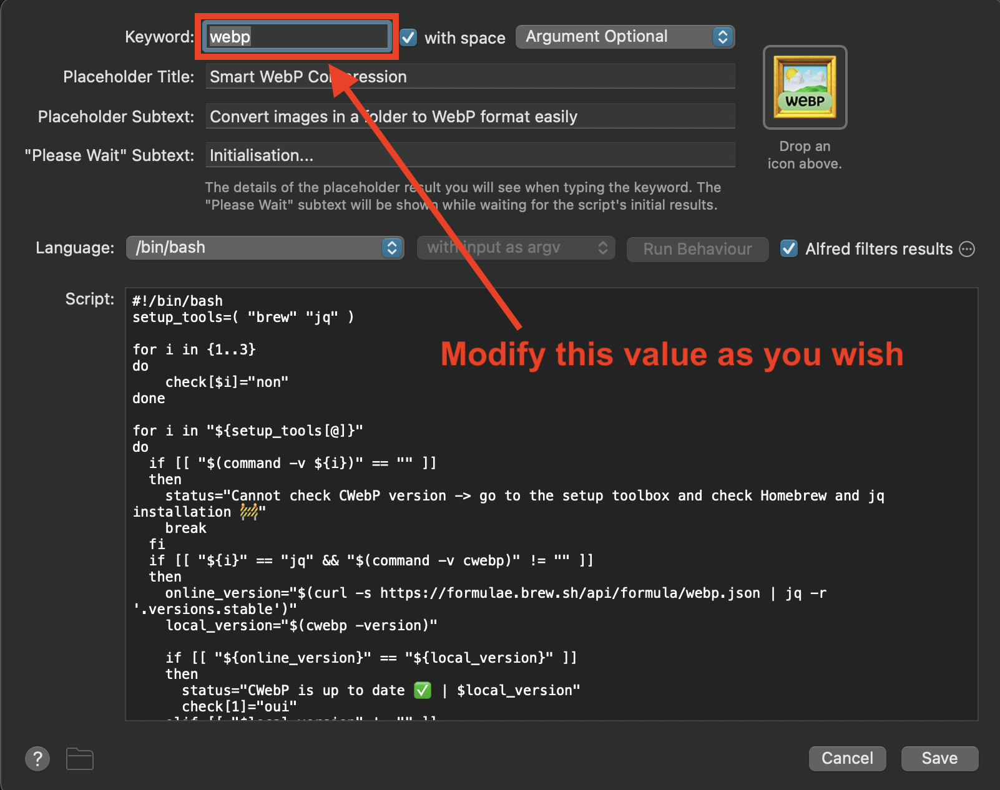

## 🧰 Setup the workflow

Note that all the following commands can be triggered within the workflow 🤓

#### Open the Terminal of you Mac and run the following commands

1. ☑️ Install Homebrew

```shell
/bin/bash -c "$(curl -fsSL https://raw.githubusercontent.com/Homebrew/install/HEAD/install.sh)"
```

2. ☑️ Install cwebp jq and cpanm

```shell
brew install webp | brew install jq | brew install cpanm
```

3. ☑️ Install Mojolicious

```shell
cpanm Mojolicious --sudo
```
 
#### Check your installation under the Setup toolbox of the workflow

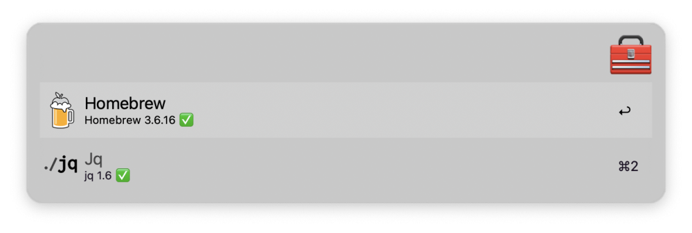

If something is not installed you'll have the following message

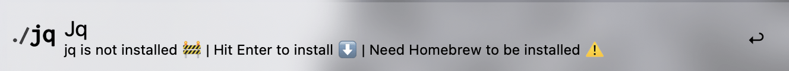

#### CWebP version can be seen in the home menu.

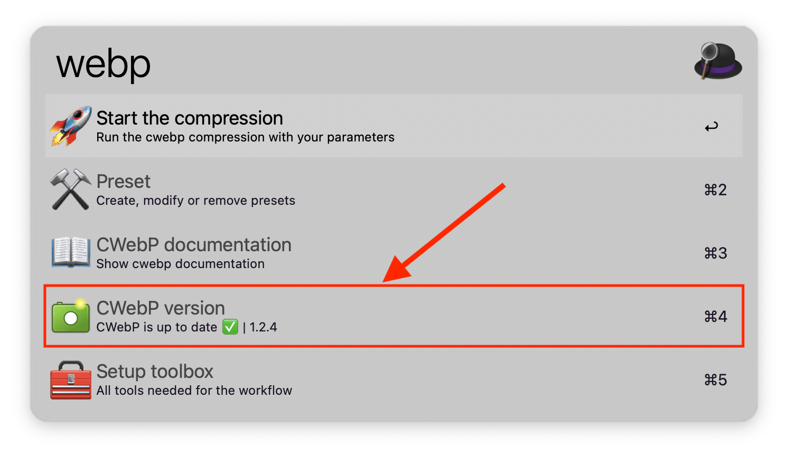

 The workflow is also looking for cwebp updates each time you run the workflow ✨

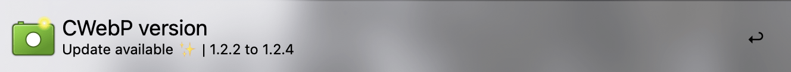

## 👷‍♂️ Environment variables

### 📖 Documentation folder

❗ This variable cannot be empty. It's not recommended to change it.

It contains the content of cwebp documentation within Alfred. You can refresh this documentation in the workflow


### 📂 Presets and Logs folder

❗ This variable cannot be empty. You can change it at your convenience.

It contains the presets created within the workflow + output logs of the cwebp compression.

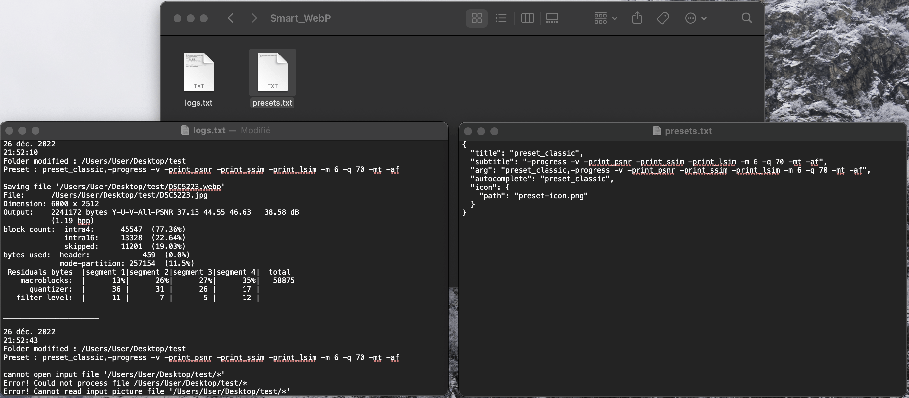

### 🖼️ Images folder

⚠️ This variable must be set before running the compression.

This is the target folder where images are placed for the compression. You can change it within the workflow in the home menu.


### ⚒️ Selected Preset

⚠️ This variable must be set before running the compression.

The preset selected preset within the workflow holds all the cwebp [options] used for the compression. The preset selected is shown as the subtitle in the home menu.

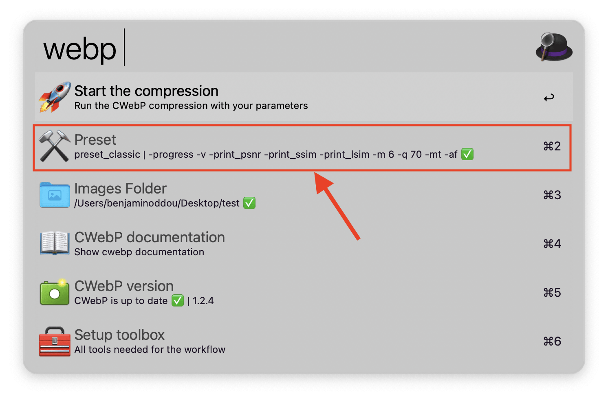

## 🤖 Usage of the workflow

### 🆕 Create New preset

Go under the preset section and click on "Add a preset"

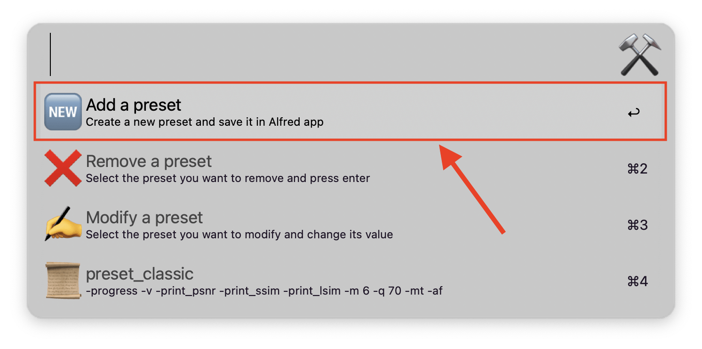

Add your preset by putting `preset_name,preset_detail`. Note that the comma (`,`) is separating the name of the preset from its content. The content correspond to the cwebp [options] which can be found under the documentation section.

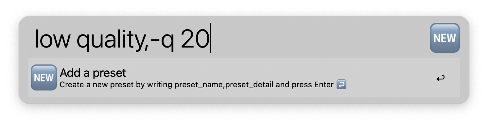

The created preset can be seen under the preset section. New presets are put on top of older ones.

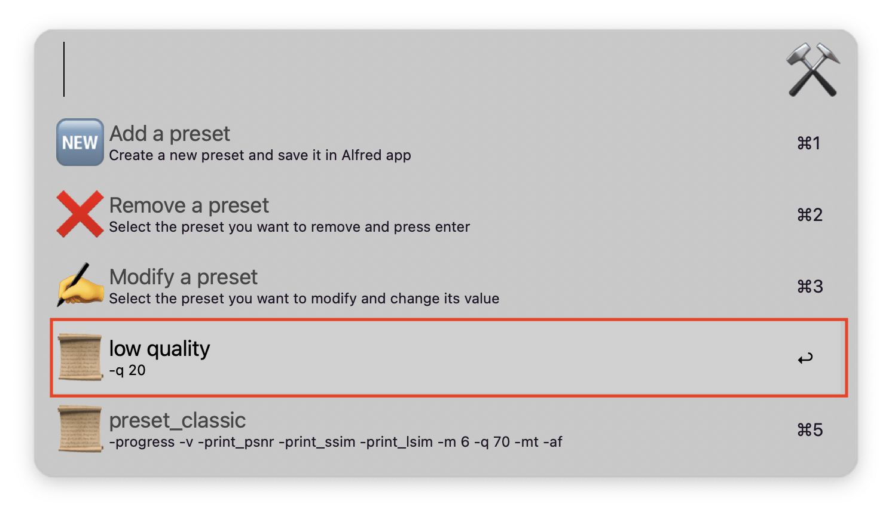

### 👉 Select a preset

Under the preset section, click on a preset to select it.

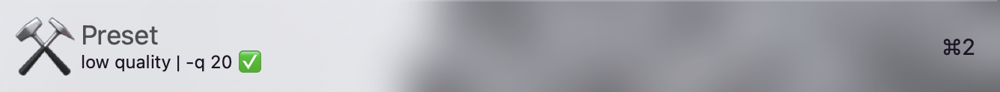

### ✍️ Modify a preset

Under the preset section, click on "Modify a preset".

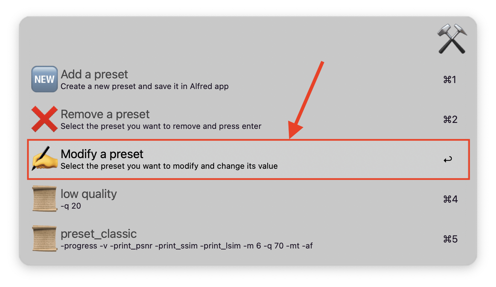

Select the preset you want to modify.

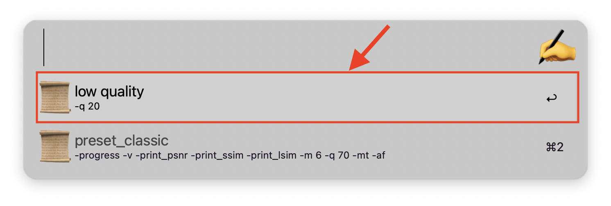

Change its name/value and press enter. Don't remove the separator (`,`).

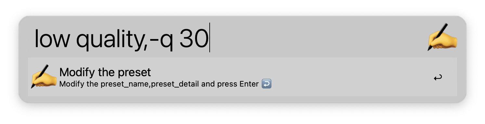

### ❌ Remove a preset

Under the preset section, click on "Remove a preset".

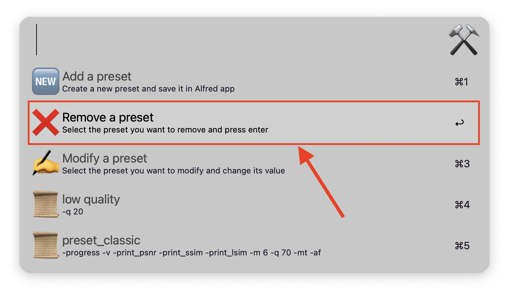

Select the preset you want to remove.

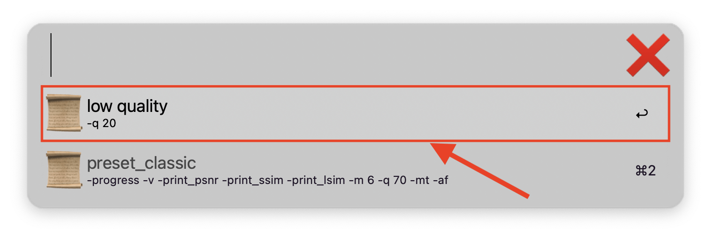

## 🖼️ Modify the images folder

*See also environment variables above* 👆

Select the "Images Folder" under the main menu and search for the new one under Alfred. You can also manually change it under the configuration panel of the workflow.

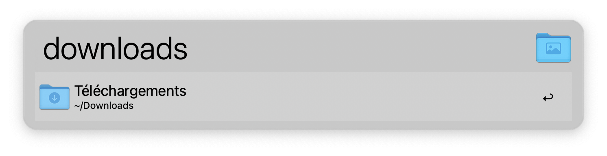

## 🚀 Start the compression

Once the workflow the preset and the images folder are set correctly, click on "Start the compression" under the home menu.

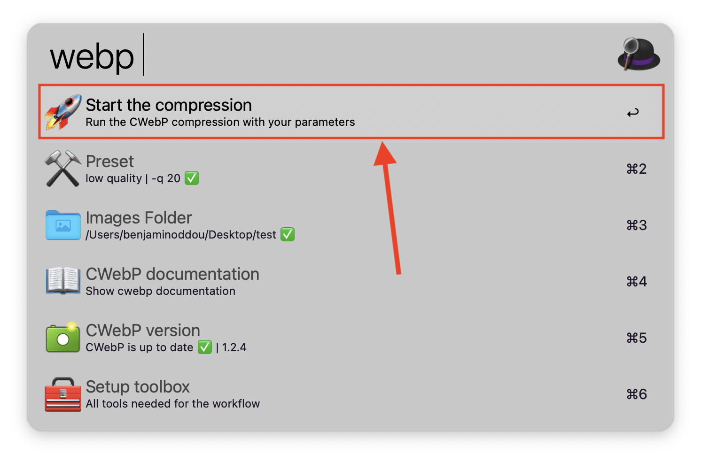

Check the logs of your compression under the 📂 Presets and Logs folder. The log file contains the 2 part. In the orange box there is the {date}, {time}, {var:img_folder} and {var:the_preset}. the output of the terminal is shown under the green box. Each compression is separated by a line.


## ⚖️ License

[MIT License](LICENSE.md) © Benjamin Oddou
