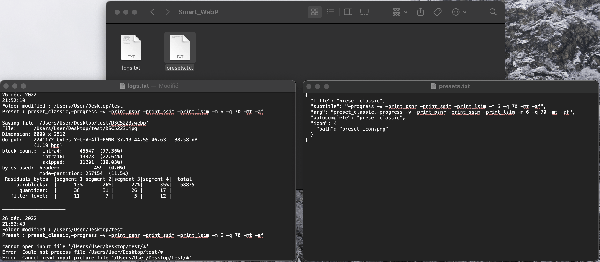
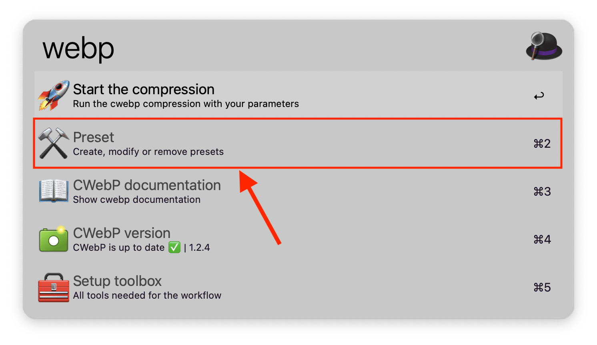
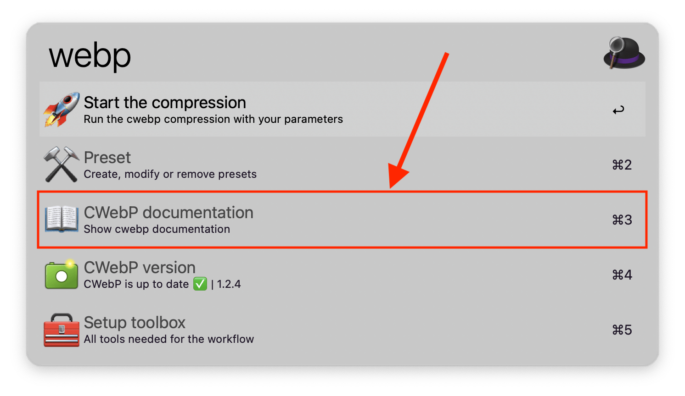
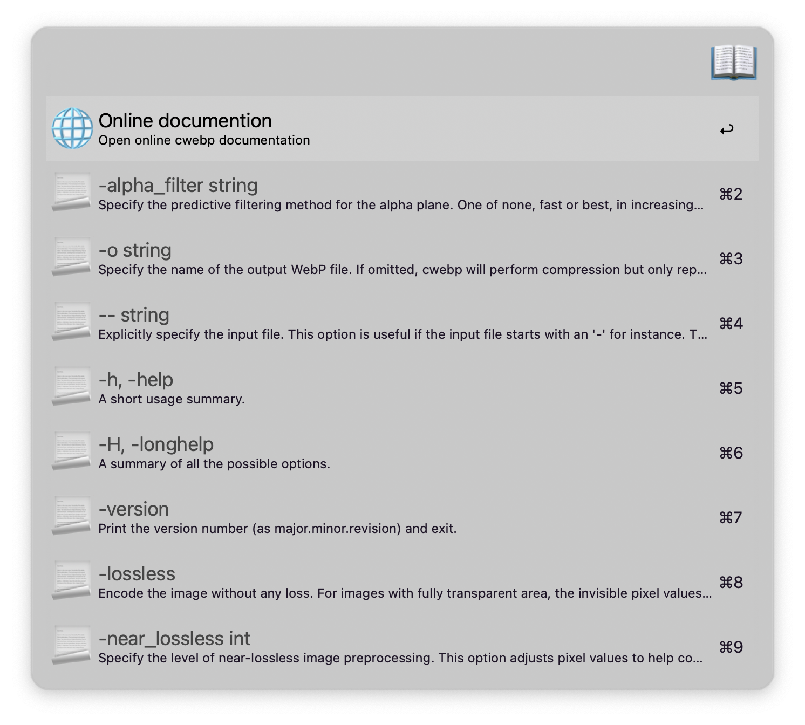
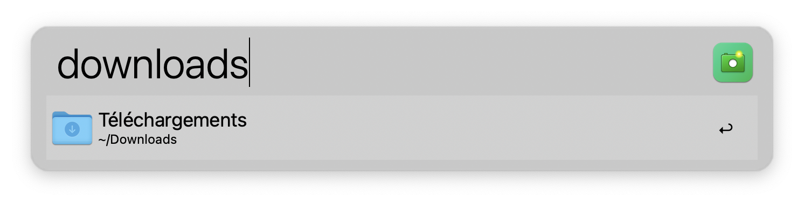
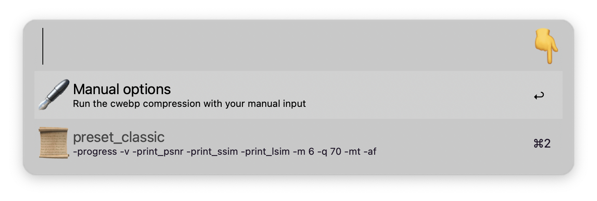
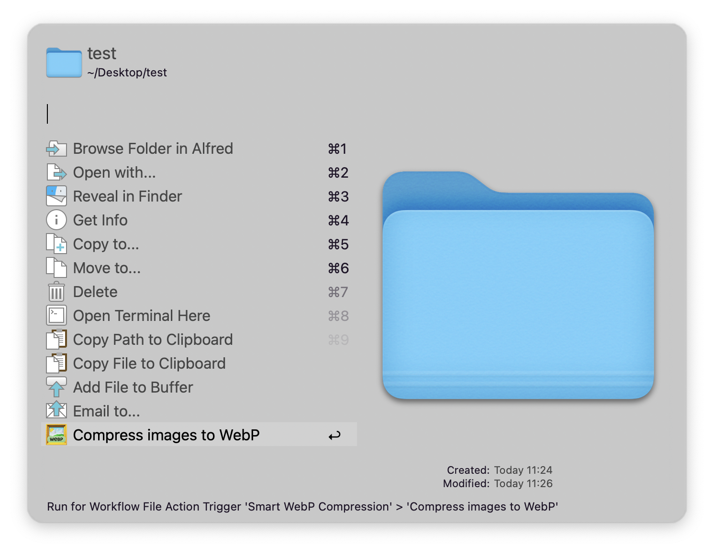
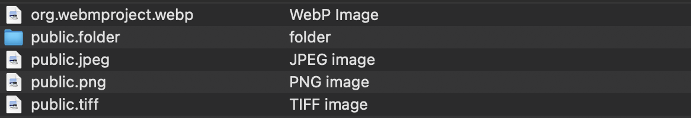

[](https://github.com/BenjaminOddou)
[](https://saythanks.io/to/BenjaminOddou)

Welcome to the Alfred Smart WebP Compression repository: **An Alfred Workflowk** ✨

## ✅ Prerequisite

* 🍎 MacOS
* 🎩 Alfred 5. Note that the [Alfred Powerpack](https://www.alfredapp.com/powerpack/) is required to use workflows.

## ℹ️ information

* 🏎️ Under the hood, the compression is made with [cwebp](https://developers.google.com/speed/webp/docs/cwebp) (made by Google), a tool that allows to compress images into the WebP format, which is generally lighter 🪶, and broadly used to share images on the web.

## ⬇️ Installation

1. [Download the workflow](https://github.com/BenjaminOddou/alfred-smart-webp-compression/releases/latest)
2. Double click the `.alfredworkflow` file to install


## 🧙‍♂️ Invoke the Workflow

You can invoke the workflow by writing `webp` onto the Alfred search box. You can change this value by changing the `🕹️ Workflow trigger` variable in workflow configuration panel [optionnal].

## 🧰 Setup the workflow

### 👨‍💻 Install dependencies

#### Open the Terminal of you Mac and run the following commands

1. ☑️ Install Homebrew.

```shell
/bin/bash -c "$(curl -fsSL https://raw.githubusercontent.com/Homebrew/install/HEAD/install.sh)"
```

2. ☑️ Install cwebp and jq.

```shell
brew install webp | brew install jq
```
 
#### Check your installation under the Setup toolbox of the workflow


If something is not installed you'll have the following message :


#### CWebP version can be seen in the home menu


✨ The workflow is also checking the cwebp version each time you run it.


### 📂 Data (Presets and Logs) folder

❗ This variable cannot be empty. You can change it at your convenience in the workflow configuration panel.

It contains the presets created within the workflow + output logs of the cwebp compression.

> 💡 Note that if you change the `Data folder` location after creating presets and logs, you should probably move the files created along in the new folder.



## 🤖 Usage of the workflow

### ⚒️ Handling presets

Go under the home menu and open the `presets section`.



#### Create a preset

Go under the `presets section` and click on "Add a preset".


Add your preset by putting `preset_name,preset_detail`. Note that the comma (`,`) is separating the name of the preset from its content. The content correspond to the cwebp [options] which can be found under the documentation section.


The created preset can be seen under the preset section. New presets are put on top of older ones.


#### Modify a preset

Under the `presets section`, click on "Modify a preset".


Select the preset you want to modify.


Change its name/value and press enter ⏎. Don't remove the separator (`,`).


#### Remove a preset

Under the `presets section`, click on "Remove a preset".


Select the preset you want to remove.


### 📖 Check the documentation

Go under the `documentation section` from the home menu :



Go to the online documentation or click on one of the options to copy it !



### 🚀 Start the compression

#### Using Workflow File Filter

Under the home menu, click on "Start the compression".


Select the folder with images or directly the image you want to compress and press enter ⏎.

> 💡 Note that when selecting a folder, images within subdirectories aren't selected. Only images with `png|jpg|jpeg|tif|tiff|webp` file extensions are selected. In addition, they aren't case sensitive, meaning that the image extension can be `PNG|JpG|tifF...`



Alternatively, use the `Alfred Buffer` to select folder(s) and image(s) at the same time !! Basic commands are :

* ⌥↑ to add a file to the buffer from Alfred's results.
* ⌥↓ to add a file and move to the next item in your list of results.
* ⌥← to remove the last item from the buffer.
* ⌥→ to action all items in the buffer.
* ⌥⌫ to remove all items from the buffer.

To know more on how to use `Alfred Buffer`, follow this [link](https://www.alfredapp.com/help/features/file-search/#file-buffer).

> 💡 Note that `Alfred Buffer` is preferred compare to the `{query}`, meaning that if you select a folder/image (by clicking on it or by pressing enter ⏎) that is not included in the buffer, **it will not be compressed**.


Choose the cwebp options by selecting a preset or input it manually by pressing "Manual options".



Check the logs of the compression. To know more on how to read logs, see the `Logs output` section below. 

#### Using Alfred Universal Actions

Select the folder(s) / image(s) you want to compress within alfred using `Quick Search` and run `Universal Actions` with → or ⌥→ if you used the `Alfred buffer`. Select "Compress images to WebP".



> 💡 Note that the workflow is type sensitive, meaning that if you select a file that is not part of the following types, the action "Compress images to WebP" will not be available



If you want to know more on how to use Alfred Universal Actions, follow this [link](https://www.alfredapp.com/help/features/universal-actions/).

#### Logs output

Check the logs of your compression under the `Data folder`. The log file contains the 2 part. 

1. In the orange box there is :
	* `{date:short}` : Date of the compression with a `yyyy/MM/dd` pattern.
	* `{time}` : Exact time of the compression with a `HH:mm:ss` pattern.
	* `user input : {var:_links_list}` : Folder(s) + image(s) path(s) selected with a tab ⇥ separator.
	* `cwebp options : {var:_the_preset}` : Preset or manual input. Preset will be displayed as `preset_name,preset_detail` whereas manual input will be displayed raw.
2. In the green box there is the `{query}` which correspond to cwebp output.

> 💡 Note that each compression is separated by a line.


## ⚖️ License

[MIT License](LICENSE) © Benjamin Oddou
